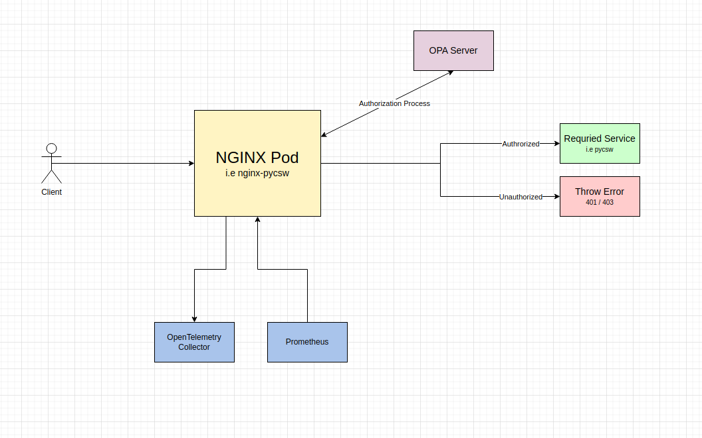

# NGINX Docker Image & Helm Chart for Openshift

## Application Architecture Overview



This repository consists of two things:

1. NGINX `Dockerfile` and its necessary assets for building

2. NGINX `Helm Chart` including `NGINX Prometheus Exporter`.

## Docker Image

We are using `nginxinc/nginx-unprivileged` as a base image in order to run NGINX with non-root privileges so it's possible to run it in an Openshift cluster (as we know, Openshift does not allow running containers with root privileges).

Besides that the `Dockerfile` is pretty straight forward so you can check it out yourself.

### Main Config Files

1.  `/etc/nginx/conf.d/deafult.conf` - Main server configurations. This server runs on port `8080` and it should process all of incoming traffic.

2.  `/etc/nginx/conf.d/status_site.conf` - This server runs on port `8081` and provides access to basic status data. You should use this server in order to make `liveness` checks on your application. This server **should not** be accessible outside the cluster.

### Authroization Mechanism

Since we are using [Open Policy Agent](https://www.openpolicyagent.org/) (aka `OPA`) as our gatekeeper, it's necessary to integrate NGINX with it.

- The docker image contains the `auth.js` file, which is responsible for handling requests that require authorization **but** the NGINX server does not actually handle the authorization process - we commented the code section responsible for this logic.

### Log Format

The docker image provides default log format (`/etc/nginx/log_format`). It's not possible to extend the log format, so if you'd want to add/remove certain fields you have to override it.

## Helm Chart

There is also an Helm Chart for deploying this NGINX in an Openshift environment (let alone any K8S environment).
Besides NGINX, this Helm Chart also deploys (on deamend) a Prometheus exporter for NGINX using [nginx-prometheus-exporter](https://github.com/nginxinc/nginx-prometheus-exporter/). Follow the parameters below in order to configure NGINX and its Prometheus exporter as you wish.

### Parameters

For a detailed list of configurable values, please refer to the [values.md](./values.md) file.  
These are the main parameters you should adjust when you deploy this Helm Chart. You can find all parameters in the `values.yaml` file.

There's an option to dynamically add annotations to the pod. You might find it useful if you operate on different environments and need to customize your annotations. It can be done by editing the `additionalPodAnnotations` parameter.

There's support for instrumenting NGINX with OpenTelemetry (currently only for tracing). Simply the relevant parameters in the `values.yaml` file.

#### Overriding NGINX configuration files

If you wish to override the default configuration files, you can do it by providing an external ConfigMap and supplying Volumes & VolumeMounts that'll be added to the Deployment.
In this example we override the `default.conf` file by creating a ConfigMap and overriding the `extraVolumes`, `extraVolumeMounts` and `sidecars` sections:

```
apiVersion: v1
kind: ConfigMap
metadata:
  name: nginx-extra-configmap
data:
  default.conf: {{ tpl (.Files.Get "config/default.conf") . | quote }}
```

And then, in the `values.yaml` file:

```
...
extraVolumes:
  - name: nginx-extra-config
    configMap:
    name: 'nginx-extra-configmap'
extraVolumeMounts:
  - name: nginx-extra-config
    mountPath: "/etc/nginx/conf.d/default.conf"
    subPath: default.conf
sidecars:
 - name: envoy
   image: "envoyproxy/envoy:v1.20.7"
   volumeMounts: []
   args: []
   resources: {}
   ports: []
...
```
